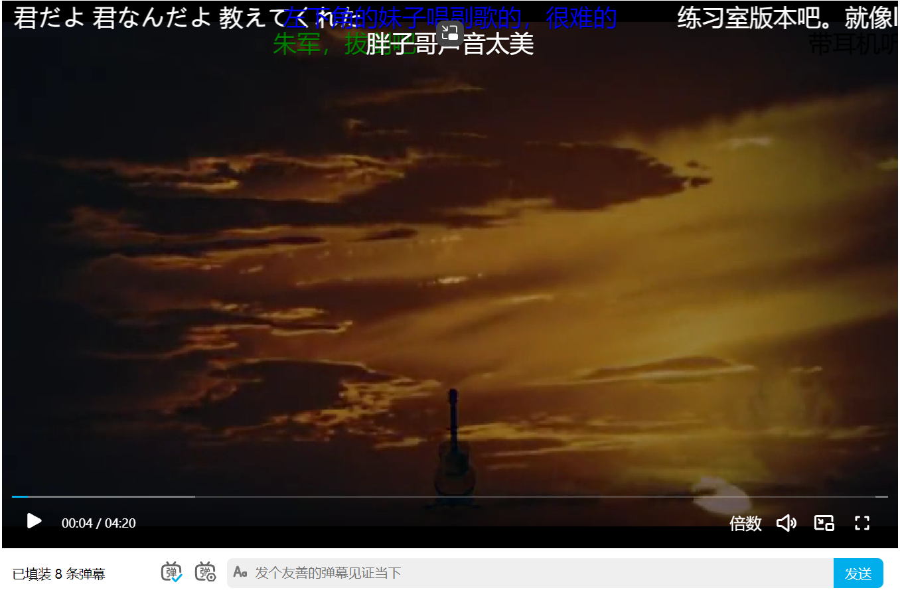

## 效果图


## 快速开始

`npm i bili-player`

```html
<template>
  <bili-player
    ref="biliPlayerRef"
    style="width: 900px; height: 550px"
    v-bind="playerProps"
  />
</template>

<script setup lang="ts">
import "bili-player/style.css";
import { onMounted, ref } from "vue";
import {
  BiliPlayer,
  type BiliDanmakuItem,
  type BiliPlayerProps,
} from "bili-player";

const biliPlayerRef = ref<InstanceType<typeof BiliPlayer>>();
const playerProps: BiliPlayerProps = {
  video: {
    poster: "https://i.loli.net/2019/06/06/5cf8c5d9c57b510947.png",
    url: "https://api.dogecloud.com/player/get.mp4?vcode=5ac682e6f8231991&userId=17&ext=.mp4",
    autoplay: true,
  },
  danmaku: {
    sendCallback: async (data: BiliDanmakuItem) => {
      // request send
    },
    filter: (data: BiliDanmakuItem) => {
      // 屏蔽弹幕 '前方高能'
      return !data.content.includes("前方高能");
    },
  },
};

const danmaItems: BiliDanmakuItem[] = [
  { content: "君だよ 君なんだよ  教えてくれた", time: 1, type: 0, color: "white" },
  { content: "Goose house炒鸡棒！！！  银之匙种草他们组合", time: 1.2, type: 2, color: "red" },
  { content: "朱军，拔剑吧", time: 1.6, type: 0, color: "green" },
  { content: "听了好多次", time: 6.6, type: 1, color: "white" },
  { content: "带耳机听，贝斯的声音会更加带感！", time: 4.3, type: 0, color: "black" },
  { content: "胖子哥声音太美", time: 3.2, type: 1, color: "white" },
  { content: "练习室版本吧。就像live和专辑。", time: 3.6, type: 0, color: "white" },
  { content: "左下角的妹子唱副歌的，很难的", time: 2.2, type: 1, color: "blue" },
];
onMounted(() => {
  const danmaControl = biliPlayerRef.value?.getDanmaControls();
  danmaControl?.setDanmakus(danmaItems);
});
</script>
```

## 参数说明
| 名称                   | 类型                                                  | 描述                                 | 默认值 |
| ---------------------- | ----------------------------------------------------- | ------------------------------------ | ------ |
| hotkey                 | boolean                                               | 开启快捷键                           | true   |
| video                  | BiliVideoProps                                        | 视频参数                             |        |
| video.url              | string                                                | 视频路径                             |        |
| video.poster           | string                                                | 封面路径                             |        |
| video.track            | string                                                | 字幕路径                             |        |
| video.loop             | boolean                                               | 是否循环播放                         | false  |
| video.autoplay         | boolean                                               | 是否自动播放                         | true   |
| video.volume           | number                                                | 默认音量大小                         | 0.5    |
| video.rate             | number                                                | 播放速率                             | 1      |
| danmaku                | BiliDanmakuProps                                      |                                      |        |
| danmaku.show           | boolean                                               | 展示弹幕                             | true   |
| danmaku.fontRatio      | number                                                | 字体大小比率，0.5 - 1.5              | 1      |
| danmaku.fontBold       | boolean                                               | 字体是否加粗                         | false  |
| danmaku.speed          | number                                                | 速度 0.5 - 2.0                       | 1      |
| danmaku.opacity        | number                                                | 不透明度 0 - 1                       | 1      |
| danmaku.displaySize    | number                                                | 显示区域 0.25 - 1                    | 1      |
| danmaku.visible.move   | boolean                                               | 滚动弹幕显示                         | true   |
| danmaku.visible.top    | boolean                                               | 顶部弹幕显示                         | true   |
| danmaku.visible.bottom | boolean                                               | 底部弹幕显示                         | true   |
| danmaku.visible.color  | boolean                                               | 彩色弹幕显示                         | true   |
| danmaku.sendCallback   | (dan: BiliDanmakuItem) => Promise<any> \| any         | 发送弹幕回调，若不发送，抛出错误即可 |        |
| danmaku.filter         | (dan: BiliDanmakuItem) => boolean \| Promise<boolean> | 弹幕显示过滤                         |        |

## API说明
| 名称             | 描述                                                     |
| ---------------- | -------------------------------------------------------- |
| getVideoControls | 获取视频控制器，返回基于vueuse的useMediaControls的返回值 |
| getDanmaControls | 获取弹幕控制器                                           |